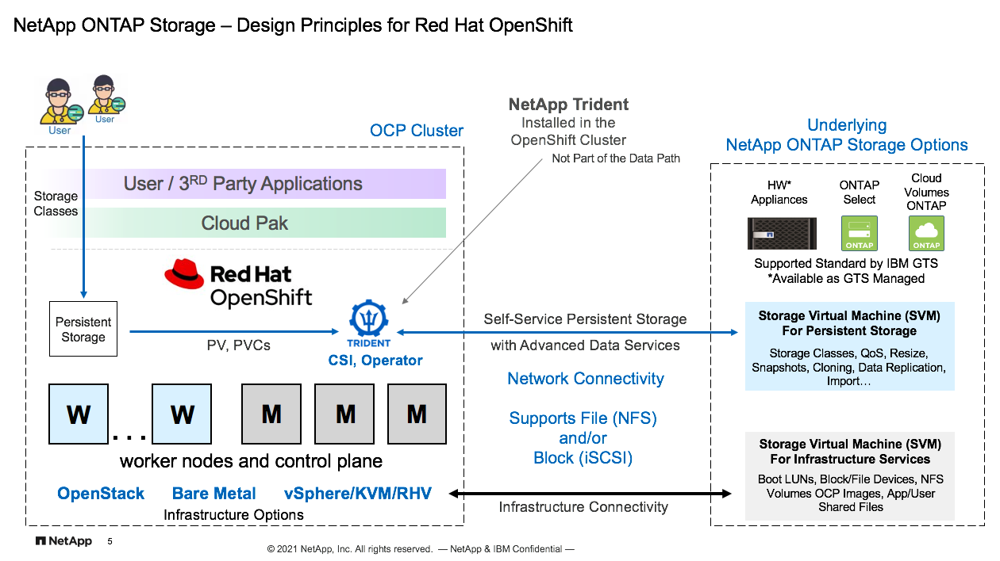
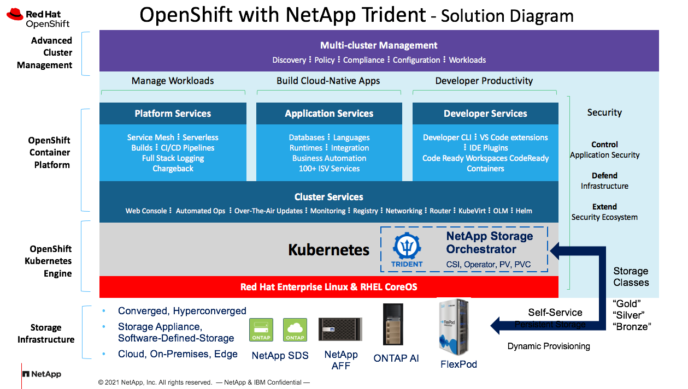

#NetApp ONTAP for OpenShift – Key Design Principles

ℹ️ **Page Owner: Jacky Ben-Bassat**

ℹ️ **GSI Technical Manager, IBM & Red Hat**

**As a:** Solutions Architect

**I want to:** learn about the design princimple of NetApp storage and data management capabilities, benefits and features in an OpenShift Solution

**So that I:** can understand how to position NetApp ONTAP storage, when to use it and how to leverage its features in an OpenShift solution to maximize the benefits to the customer

ℹ️ **Status**

- [X] Structure
- [X] Draft
- [ ] Reviewed
- [ ] Ready
- [ ] Published

ℹ️ **Classification**

- [ ] IBM Confidential
- [X] Public
## Concepts of ONTAP Storage systems
### ONTAP Portfolio
NetApp ONTAP, is an industry leading enterprise data management software, combines new levels of simplicity, flexibility, and security with powerful data management capabilities, proven storage efficiencies, and leading cloud integration. The current major release of ONTAP is ONTAP 9 and it is delivered as the standard storage OS in the entire AFF and FAS hardware appliances from NetApp, as well as on the software-based storage offerings available in leading cloud providers. ONTAP is mature storage OS, rich with features and capabilities and is installed at many thousands of customers. ONTAP is supported standard by IBM GTS and also used for the major storage offerings in the IBM Cloud, namely Endurance and Performance, and also beyond. As described below, ONTAP is available in various flavors. A pdf with additional information about NetApp ONTAP software can be found [here] (https://www.netapp.com/pdf.html?item=/media/7413-ds-3231.pdf), and a link to the published web content can be found [here](https://www.netapp.com/data-management/ontap-data-management-software/).

 - **HW Appliances**

		ONTAP comes with NetApp’s AFF (All-Flash FAS) and FAS Fabric-Attached-Storage) product lines. These are hardware appliances that vary in sizes and performance characteristics but share the same set of key ONTAP features. Please follow the link to [AFF](https://www.netapp.com/data-storage/all-flash-documentation/) and to [FAS]( https://www.netapp.com/data-storage/fas/) for more details.
FAS and AFF are also included in converged infrastructure solutions in partnership between NetApp and Cisco [(FlexPod)](https://www.netapp.com/data-storage/flexpod/), and NetApp and Nvidia DGX for Intense AI workloads [(ONTAP AI)](https://www.netapp.com/artificial-intelligence/ontap-ai/ ).

 -  **Cloud Storage**

		ONTAP is also available in leading public clouds as Cloud Volumes ONTAP [(CVO)](https://docs.netapp.com/us-en/occm/concept_overview_cvo.html) offerings in [AWS](https://aws.amazon.com/marketplace/pp/B011KEZ734), [Azure](https://azuremarketplace.microsoft.com/en-us/marketplace/apps/netapp.netapp-ontap-cloud?tab=Overview), and [GCP](https://console.cloud.google.com/marketplace/product/netapp-cloudmanager/cloud-manager).

 - **Software only**

		In addition to AFF, FAS and CVO, ONTAP is available as a software on a VM which can be deployed on vSphere or KVM. This version of ONTAP is called ONTAP Select. ONTAP Select can be deployed on commodity servers that supports the Hypervisor requirements. ONTAP Select can also be deployed in the [IBM Cloud](https://www.ibm.com/cloud/architecture/files/IBM_Cloud_for_VMware_Solutions_NetApp_Architecture.pdf).  Please check the [ONTAP Select] (https://www.netapp.com/data-management/software-defined-storage-ontap-select/documentation/)  documentation for more information.

 - **Other ONTAP-based storage services**

		Azure NetApp Files (ANF) and Cloud Volumes Service (CVS) in AWS and GCP are also based on ONTAP technology, however these are fully managed storage services hence the level of access, control are limited as the service was designed be consumed in specific configurations of size/performance. Due to the lack of full access and control, these services are excluded from the scope of this document, however they do support OpenShift and do provide persistent storage capabilities. 

	### Multi Protocols
The strength of ONTAP system is in its flexibility. All ONTAP systems offer multiple protocols. Storage architects and admins can design the storage layout using multiple protocols and by that optimize the storage services to the specific set of workloads. AFF and the FAS500f models support FC, iSCSI, NVMe/FC, FCoE, NFS, SMB and Amazon S3, other FAS models do not support NVMe/FC but support all other protocols that can be used at the same time. ONTAP system can then serve applications that require Block as well as File storage within the same system at the same time.
	### Storage Virtual Machine (SVM)
Like a virtual machine running on a hypervisor, an SVM is a logical entity that abstracts physical resources. Data accessed through the SVM is not bound to a location in storage. Network access to the SVM is not bound to a physical port. An SVM serves data to clients and hosts from one or more volumes, through one or more network logical interfaces (LIFs). Volumes can be assigned to any data aggregate in the cluster. LIFs can be hosted by any physical or logical port. Both volumes and LIFs can be moved without disrupting data service, whether you are performing hardware upgrades, adding nodes, balancing performance, or optimizing capacity across aggregates.
The same SVM can have a LIF for NAS traffic and a LIF for SAN traffic. Clients and hosts need only the address of the LIF (IP address for NFS, SMB, or iSCSI; WWPN for FC) to access the SVM. LIFs keep their addresses as they move. Ports can host multiple LIFs. Each SVM has its own security, administration, and namespace.
Common use cases of SVM:
You can use SVMs in secure multitenancy arrangements to isolate each tenant's data, to provide each tenant with its own authentication and administration, and to simplify chargeback. You can assign multiple LIFs to the same SVM to satisfy different customer needs, and you can use QoS to protect against tenant workloads bullying the workloads of other tenants.
Cluster and SVM administration
A cluster administrator accesses the admin SVM for the cluster. The admin SVM and a cluster administrator with the reserved name admin are automatically created when the cluster is set up.
Namespaces and junction points
A NAS namespace is a logical grouping of volumes joined together at junction points to create a single file system hierarchy. A client with sufficient permissions can access files in the namespace without specifying the location of the files in storage. Junctioned volumes can reside anywhere in the cluster.
### Secure Multi Tenancy
Secure Multi-Tenancy (SMT) provides complete secure isolation between Storage Virtual Machines (SVMs) in an ONTAP Cluster. This makes ONTAP platform ideal when they are multiple tenants using it as a shared platform. ONTAP provides this capability by logically separating SVMs using IP Spaces so that inbound and outbound network communication intended for an SVM is not accessible from another SVM on the same storage platform or within the ONTAP cluster. SMT and SVM can be utilized to provision isolated storage environments with data separation to different development teams working with the OpenShift cluster
### Data Protection
ONTAP provide comprehensive, integrated data protection to safeguard your data. Meet your requirements for local backup with near-instant recovery by using space- efficient NetApp Snapshot copies. Achieve remote backup/recovery and disaster recovery with NetApp SnapMirror asynchronous replication. Plus, deep integration with leading backup applications makes management easier. There are additional Data Projection aspects to be considered when using ONTAP for OpenShift clusters, particularly with NetApp Trident , NetApp’s storage orchestration for containers and Kubernetes that provides persistent storage and integrates ONTAP and OpenShift. Some of these considerations are discussed in the **Trident Resiliency** section [here](./Trident-Resiliency.md), and general information about **Data Protection of ONTAP** can be found [here](./DataPro-Resiliency-Compliance.md).
### Storage Efficiencies
ONTAP offers a wide range of storage efficiency technologies in addition to Snapshot copies. Key technologies include thin provisioning, deduplication, compression, and FlexClone volumes, files, and LUNs. Like Snapshot copies, all are built on ONTAP's Write Anywhere File Layout (WAFL).

	- **Thin provisioning**

		A thin-provisioned volume or LUN is one for which storage is not reserved in advance. Instead, storage is allocated dynamically, as it is needed. Free space is released back to the storage system when data in the volume or LUN is deleted.

	- **Deduplication**

		Deduplication reduces the amount of physical storage required for a volume (or all the volumes in an AFF aggregate) by discarding duplicate blocks and replacing them with references to a single shared block. Reads of deduplicated data typically incur no performance charge. Writes incur a negligible charge except on overloaded nodes.

	- **Compression**
 
		Compression reduces the amount of physical storage required for a volume by combining data blocks in compression groups, each of which is stored as a single block. Reads of compressed data are faster than in traditional compression methods because ONTAP decompresses only the compression groups that contain the requested data, not an entire file or LUN.

	- **FlexClone volumes, files, and LUNs**

		FlexClone technology references Snapshot metadata to create writable, point-in-time copies of a volume. Copies share data blocks with their parents, consuming no storage except what is required for metadata until changes are written to the copy. FlexClone files and FlexClone LUNs use identical technology, except that a backing Snapshot copy is not required. 

	These features can be incorporated to the designed storage classes utilized by Trident when provisioning persistent storage in OpenShift.

	### Quality of Service (QoS)
The QoS feature of ONTAP can be utilized when designing the different storage classes to be used as persistent storage instances in the OpenShift cluster Storage architects can set policy-based limits (IOPS or MB/s, or combination). 
QoS is used for:
•	Prevent workloads from impacting performance
•	Enable critical applications to achieve consistent performance
•	Monitor and manage application workloads

## NetApp ONTAP as part of the infrastructure stack
As mentioned, ONTAP offers a lot of flexibility, which also include the ability to integrate with other infrastructure elements easily. ONTAP is validated with vSphere, KVM, Red Hat Virtualization, OpenStack, and of course, Bare Metal in case of OpenShift Virtualization settings. As such, ONTAP system can be part of the common infrastructure stack used by customers to deploy OpenShift clusters. ONTAP Select can also be deployed on Edge server to support OpenShift implementation at the Edge.
 
## NetApp ONTAP in various deployment scenarios
ONTAP complements OpenShift also when it comes to deployment models. ONTAP can be deployed in an on-premises or as Private Cloud topologies, at the Edge, or in the leading cloud providers. With common storage architecture across these various locations, customers can successfully implement OpenShift Cluster in hybrid and multi cloud topologies with NetApp ONTAP storage.

## NetApp Trident
Trident is a dynamic storage orchestrator that simplifies the consumption of persistent volumes (PV) in Kubernetes. Manage storage resource across multiple NetApp platforms. Trident provides the connection between the OpenShift platform and the underlying ONTAP storage and facilitate, the persistent storage requests of the end-users / applications, utilizing the advanced data management features of the ONTAP system. For the purpose of this solution NetApp has positioned ONTAP storage since it is the supported NetApp storage by IBM GTS, but it's important to recognize that Trident works with the entire NetApp storage portfolio, not just ONTAP products.
Trident is maintained by NetApp as an Open Source, yet NetApp customers get full support. Additional information about Trident can be found in the [NetApp-Trident Document](./NetApp-Trident.md).

### Trident and ONTAP
Trident works in conjunction with the underlying storage system. Together, Trident and the ONTAP system, provide the complete set of storage and data services to the OpenShift platform and its users and applications. Trident lives at the Kubernetes layer of OpenShift and is the connector, the messenger between the storage, and OpenShift, and it is the provisioner of the persistent storage instances. At the ONTAP storage level, storage architects can design, in advance, their storage layout, the data protection policies, the storage efficiencies features, set QoS policies, security aspects, etc. that will then be utilized by Trident as it handles, on behalf of the applications and the users, the persistent volume claims (PVC). 

The powerful combination of Trident and ONTAP provide customers with great flexibility as multiple storage classes can be created, such as "Gold", "Silver", "Bronze", each aim to meet specific set of workload/application requirements so includes different combination of features and thier settings. For a mix of workloads and applications, both Trident and ONTAP support and work with iSCSI and NFS storage protocols and these can be used at the same time within the same underlying storage system.
***
The illustration below depicts the design principles captured in this document

Trident integration with OpenShift is depicted in this illustration.

***

