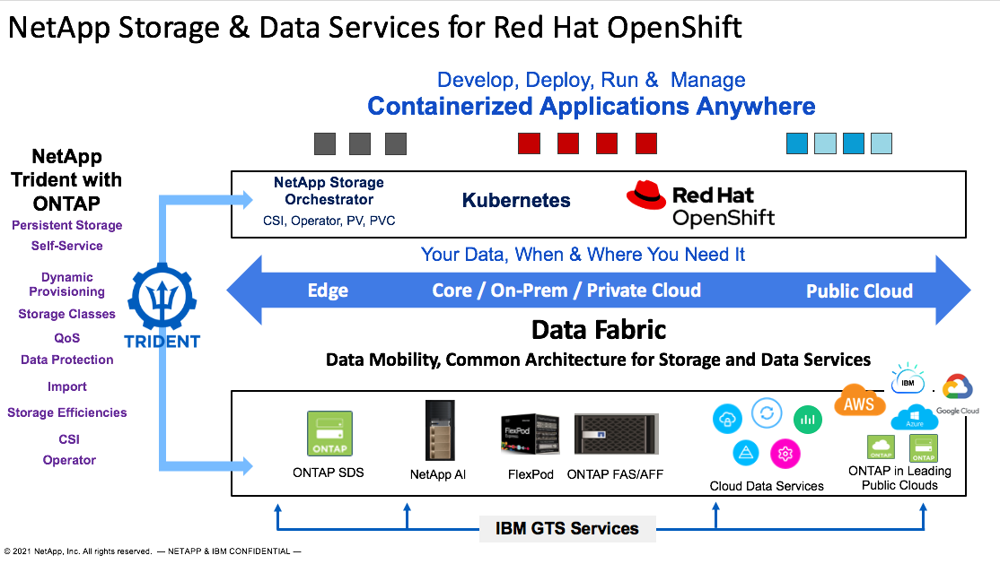

# NetApp's value proposition for Red Hat OpenShift
ℹ️ **Page Owner: Jacky Ben-Bassat**

ℹ️ **GSI Technical Manager, IBM & Red Hat**

**As a:** Solutions Architect

**I want to:**  understand what NetApp’s value proposition to OpenShift is, and how its storage and advanced data management capabilities benefits customers

**So that I:** can understand when, where, and how to position NetApp storage systems, and its features, as part of the OpenShift solution.

ℹ️ **Status**

- [X] Structure
- [X] Draft
- [ ] Reviewed
- [ ] Ready
- [ ] Published

ℹ️ **Classification**

- [ ] IBM Confidential
- [X] Public

### Main Technology:
Red Hat OpenShift

### Related Solutions/Technologies:
IBM Cloud Pak Solutions, IBM Cloud Satellite

### Purpose of this Document:
The value proposition explains how the technologies and solutions from NetApp, that can be delivered via IBM GTS, help address the challenges customers are dealing with in their Digital Transformation journey, specifically in the context of Container Orchestration, and Hybrid Cloud.

##Value Proposition Statement:
By deploying OCP clusters on NetApp ONTAP storage-based technologies, customers will benefit from a more complete solution that includes storage infrastructure and advanced data services capabilities, as well as the option to extend these capabilities to other applications and workflows running in, and connected to, the OpenShift Container Platform. These benefits can be utilized in multiple deployment models, including Private, Public and Hybrid Clouds.

###NetApp’s value to OCP can be grouped into three categories: 

1. What NetApp does in terms of fundamental storage infrastructure 

2. How NetApp automates and provides self-service 

3. Where technologies and services from NetApp can be deployed and utilize 

 

#### WHAT –  

+ Enterprise-grade, Storage Infrastructure to host the OpenShift platform, with persistent storage and advanced data services.

+ Architecture:  
 - HA, Non-disruptive Ops, Unified Architecture – Block Storage, File Storage, or both 

+ Integration:
 - Bare Metal, Hypervisors, Containers 
vSphere, KVM, RHV, OpenStack, Kubernetes, OpenShift, Satellite, Cloud Paks,  

+ Security: 
 - Multi-tenancy, Encryption, RBAC, Compliance (within Cloud Manager for CVO) 

+ Data Services: 
 - Synchronization, Tiering, Cloud Connected, Data Protection, Replication, WORM, Cloning, Deduplication, Think Provisioning 

+ Workload Optimization: 
 - QoS, Storage Classes 

 

#### How –  

Extending Storage and advanced Data Management to applications and workflows to streamline operations, and to accelerate time to market and increase business value. 
 

- Self-Service dynamic persistent Storage for Kubernetes/OpenShift (NetApp Trident) 

- Comprehensive automation capabilities with Ansible 

- Infrastructure automation 

- Service catalog integration (e.g., ServiceNow) 

- Consistency 

- Audit & Compliance 

- Enable end-users that are not storage admins 

- IaC 

- Extensive set of REST APIs throughout storage portfolio 

- Streamlining data pipelines 

- Integrate with workflows within applications (CI/CD, AI/ML) 

- Data Science Tool Kit (for AI/ML workflows)

#### Where –  

Common architecture across multiple locations with Data Mobility and services across Edge-Core-Cloud 
 
- Supports all deployment models: 

- On-Prem, Private Cloud 

- Hybrid Cloud 

- Leading Public Clouds (IBM, AWS, Azure, GCP) 

- Multi-Cloud 

- Physical Appliances (on-prem / Private) and Software-Defined-Storage (SDS) in Public Clouds 

- Storage Only, as a Converged Infrastructure solution via FlexPod with Cisco, and as Managed offering by IBM GTS 

The image below illustrates the various deployments and topologies that can be enabled and supported by NetApp technologies for OpenShift clusters.

## Common Use Cases
+ Application Modernization
+ Cloud Native Development
+ AI/ML solutions, including GPU-intense workloads
+ Open Hybrid Cloud / Infrastructure
+ Multi-cloud
+ Cloud Migration

## Related Solutions
IBM Cloud Satellite and IBM Cloud Pak solutions are built on Red Hat OpenShift platfoerm and as such, the NetApp value proposition for OpenShift can be extended to solutions tha includes these products. Additional documents describes NetApp's integration with IBM Satellite and Cloud Paks.