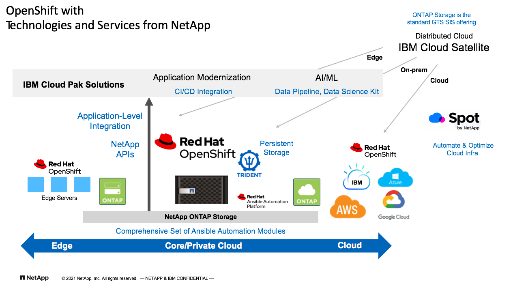

# Why NetApp for Red Hat OpenShift
ℹ️ **Page Owner: Jacky Ben-Bassat**

ℹ️ **GSI Technical Manager, IBM & Red Hat**

**As a:** Solutions Architect

**I want to:** understand how NetApp helps solving customer challanges associated with deploying and managing thier OpenShift clusters

**So that I:** can understand when, where, and how to position NetApp technologies as part of the OpenShift solution.

ℹ️ **Status**

- [X] Structure
- [X] Draft
- [ ] Reviewed
- [ ] Ready
- [ ] Published

ℹ️ **Classification**

- [ ] IBM Confidential
- [X] Public
*** 
## Solving Customer Challanges: 

For many customers, container orchestration is a new technology, and it is also a relatively young technology when compared to traditional IT infrastructure, DevOps tools and practices, hypervisors/virtualization technologies, etc. As such, many organizations struggle with the adoption of container orchestration. Part of the many challenges that customers are facing when adopting, deploying and managing their OpenShift platforms is related to Storage and Data Management. In this document we will explore what these challenges are and what NetApp offers to help address them.  

## The top 10 challenges and how NetApp helps address them: 

**1. The need for Persistent Storage for containers and container orchestration** 

 - NetApp Trident - Storage Orchestration for Kubernetes (and OpenShift)

**2. Data Mobility across multiple OCP clusters** 

 - Combined set of advanced data management features of NetApp ONTAP with NetApp Trident  

**3. How to simplify and streamline operation, accelerate speed and time to market?** 

 - Extensive set of Ansible automation modules
 - Trident as self-service for persistent storage provisioning
 - Comprehensive set of REST APIs extending storage features to applications workflows
 - Unified Storage Architecture (storage infrastructure simplification)

**4. How to enable and simplifying hybrid cloud deployments?**

 - NetApp storage architecture and the advanced data management capabilities are available for on-prem and cloud-based deployments enabling private, hybrid and public cloud. 

 - NetApp’s ONTAP & Trident enable data mobility and advanced services across multiple clusters. 
 
**5. A solution that is more complete with higher end-to-end value**

 - The value proposition from NetApp extends beyond a storage platform to host OCP or to provide persistent storage capabilities. NetApp's value proposition is comprehansive and addresses many challanges are facing when managing the storage and data aspects associated with their OpenShift environment 

**6. A solution that is flexible, easily integrated, easy to deploy, manage and consume** 

 - NetApp storage and data management address challenges in a more complete solution approach: 

 - Leading enterprise grade storage platform – ONTAP-based (IBM Cloud and GTS standard) 

 - SDS and Cloud Storage options (IBM Cloud, GCP, Azure, AWS) 

 - Data Mobility across locations/sites with advanced data management capabilities 

 - Self-Service persistent storage, storage classes (within the Kubernetes/OpenShift CSI, Operator, PV, and PVC constructs) 

 - APIs to integrate with end user workflows for CI/CD, AI/ML, extending data management. 

 - Ansible Automation modules  

 - Cloud Data Services for additional capabilities enhancing value of cloud-based deployment – NetApp Spot, Astra (coming summer 2021) 

**7. Migration to cloud, changes in future infrastructure state**

 - NetApp’s common storage architecture. The same ONTAP technology is available for on-prem as an appliance or as SDS in the leading public clouds, including self-managed and a STaaS options, as well as IBM GTS Managed (PCIaaS and within Satellite SIS) 

 - Ansible Automation modules work the same across all ONTAP deployments. 

 - Trident works on-prem and in the cloud 

 - Trident and ONTAP can simplify data replication between sites and support import of persistent storage instances. 

 - ONTAP storage can be a platform to bare metal, VM and containers supporting longer duration projects where different integration and infrastructure components are needed such as in support of Application Modernization, Application consolidation and migration to cloud, etc. 

**8. Risks, unknown or not so clear plan**  

 - NetApp’s unified architecture – easier to make changes with NetApp, less technologies in the mix, supporting multiple protocols, workloads, and deployment models with the same ONTAP storage all lead to more flexibility and less risk.

**9. Not sure where and how to start** 

 - NetApp ONTAP is an IBM GTS standard and a technology supported by IBM TSS. IBM GTS services can help customers from early stages of planning, to deployment and managing OpenShift clusters. If and as needed, SMEs from NetApp can work in collaboration with IBM.

**10. Customers want reliable proven technologies** 

 - NetApp's ONTAP is the storage technology behind the main storage offerings in the IBM Cloud (Endurance and Performance) 
 - OpenShift and other SaaS in the IBM Cloud are running on NetApp ONTAP storage
 - The storage services in the IBM Cloud that are based on NetApp have the highest uptime/availability in the industry 
 - NetApp is a leading storage vendor and ONTAP is a mature technology used by thousands of customers, many are joint IBM-NetApp customers

 ***

As can be concluded from the information provided above, an OpenShift solution can be more complete when incorporating the various technologies and services from NetApp, and the image below illustrates that complete end-to-end value NetApp brings to customers for their OpenShift deployments.

***
